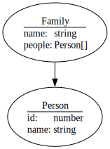
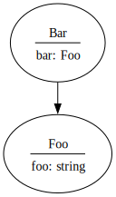
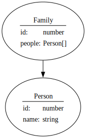
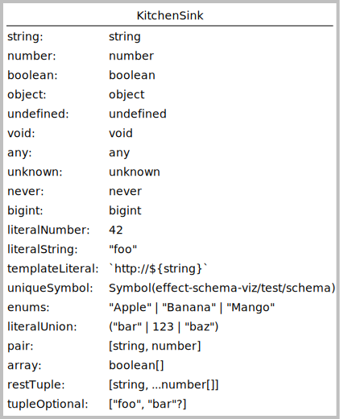

# `effect-schema-viz`

Visualize your Effect/Schema.

<!-- @import "[TOC]" {cmd="toc" depthFrom=1 depthTo=6 orderedList=false} -->

<!-- code_chunk_output -->

- [`effect-schema-viz`](#effect-schema-viz)
  - [Quick Start](#quick-start)
    - [1. Requirements](#1-requirements)
    - [2. Install](#2-install)
    - [3. Use From Code](#3-use-from-code)
  - [Examples](#examples)
  - [Features](#features)
  - [Limitations](#limitations)
  - [See Also](#see-also)

<!-- /code_chunk_output -->

## Quick Start

### 1. Requirements

[Effect](https://www.npmjs.com/package/effect) obviously, but you will also need
the `dot` executable from [Graphviz](https://graphviz.org) in your path to
generate images from `.dot` files.

For the _quick start example_ below you will also need `tsx`:

```sh
pnpm add -D tsx
```

### 2. Install

```sh
pnpm add -D effect-schema-viz
```

### 3. Use From Code

Create a script in your project source folder, for example `src/show-schema.ts`:

```ts
#!/usr/bin/env tsx

import {Schema, pipe} from 'effect'
import {setIdentifier, schemasToDot} from 'effect-schema-viz'

class Person extends Schema.Class<Person>('Person')({
  id: Schema.Number,
  name: Schema.String,
}) {}

const Family = pipe(
  { name: Schema.String, people: Schema.Array(Person) },
  Schema.Strict,
  // Unlike classes, anonymous structs must be identified
  setIdentifier('Family')
)

const dot = schemasToDot('example')(Person, Family)

console.log(dot)
```

Run the script with:

```sh
tsx src/show-schema.ts > diagram.dot && dot -Tsvg diagram.dot > diagram.svg
```

Your SVG diagram should look like this:



## Usage

### Importing

Everything can be imported from the single entry point `effect-schema-viz`:

```ts
import {schemasToDot} from 'effect-schema-viz'
import MyObjectTypeSchema from 'somewhere'

console.log(schemasToDot(MyObjectTypeSchema))
```

### Graphing Object Type Schemas

#### Error Handling

### Customizing Appearance

Besides the _identifier_ annotation used to identify anonymous structs, Graphviz
node and edge attributes are also encoded in schema annotations. You can set
these annotations using the functions `setNodeOptions` and `setEdgeOptions`.

Note Graphviz attributes are not orthogonal to each other. For example, setting
the node attribute `fillcolor` will only work if the `style` attribute does not
include `filled`, as [explained here](https://graphviz.org/doc/info/shapes.html#styles-for-nodes).

#### Labels

By default nodes will be configured with
[Graphviz HTML labels](https://graphviz.org/doc/info/shapes.html#html). You can
set your own label by setting the `label` entry on the Graphviz attributes of a
node. If we find a node attributes that already have a `label`, the label is
left untouched. For example to request that the schema object type `ClassFoo` be
rendered as a `box` shape with a simple label we can annotate the schema:

```ts
import {setNodeOptions} from 'effect-schema-viz'

const annotated = setNodeOptions({
  label: 'ClassFoo',
  shape: 'box',
})(ClassFoo)
```

## Examples

|                Source                              |                   Diagram             |
|----------------------------------------------------|---------------------------------------|
|[struct.ts](src/test/examples/struct.ts)            |       |
|[class.ts](src/test/examples/class.ts)              |       |
|[kitchenSink.ts](src/test/examples/kitchenSink.ts)  | |
|[dependencies.ts](src/test/examples/dependencies.ts)||

## Features

1. Render your `Effect/Schema` object types, structs or classes, in Graphviz, and the relations between them as edges.
2. Customize Graphviz node attributes per node, and the Graphviz edge attributes for all _outgoing_ edges of a node.
3. Besides annotating your anonymous structs with unique identifiers, no special work required to graph your schemas. Simply send the object types you want to graph to `schemasToDot` and get back a Graphviz `.dot` file in a string.

## Limitations

1. Without parsing the source, `effect-schema-viz` cannot know the _names_ of your `Structs`. To get useful diagrams, you should annotate your structs with the identifier annotation, using on of:
    1. `Effect/Schema` [identifier annotation](https://github.com/Effect-TS/effect/blob/main/packages/effect/src/SchemaAST.ts#L109)
    2. Create your structs using [Struct.named(name)({...})](https://github.com/middle-ages/haag59-monorepo/blob/main/packages/effect-schema-viz/src/schema/annotations.ts#L76).
    3. Call the function [setIdentifier](https://github.com/middle-ages/haag59-monorepo/blob/main/packages/effect-schema-viz/src/schema/annotations.ts#L44) on the `Struct`.
    4. Use classes instead of structs, or wrap your structs with classes as they can be identified with no extra work.
2. No support yet for relations other than _has a_.
3. No support yet for _Records_ or _index signatures_.
4. No support yet for _custom declarations_.

## See Also

1. [API Documentation](https://middle-ages.github.io/effect-schema-viz-docs).
2. [`src/diagram`](src/diagram) package [type diagram](https://raw.githubusercontent.com/middle-ages/haag59-monorepo/refs/heads/main/packages/effect-schema-viz/src/diagram/doc/effect-schema-viz-diagram-model.png).
3. [graphviz-ts](https://github.com/ts-graphviz/ts-graphviz).
4. [Effect/Schema](https://effect.website/docs/schema/introduction).
