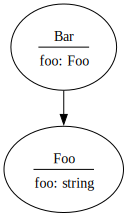

# `effect-schema-viz`

Visualize your Effect/Schema.

<!-- @import "[TOC]" {cmd="toc" depthFrom=1 depthTo=6 orderedList=false} -->

<!-- code_chunk_output -->

- [`effect-schema-viz`](#effect-schema-viz)
  - [Quick Start](#quick-start)
    - [1. Requirements](#1-requirements)
    - [2. Install](#2-install)
    - [3. Use From Code](#3-use-from-code)

<!-- /code_chunk_output -->

## Quick Start

### 1. Requirements

[Effect](https://www.npmjs.com/package/effect) obviously, but you will also need
the `dot` executable from [Graphviz](https://graphviz.org) in your path to
generate images from `.dot` files.

For the examples below you will also need `tsx`:

```sh
pnpm add -D tsx
```

### 2. Install

```sh
pnpm add -D effect-schema-viz
```

### 3. Use From Code

Create a script in your project source folder, for example `src/show-schema.ts`:


```ts
#!/usr/bin/env tsx

import {Schema, pipe} from 'effect'
import {setIdentifier, structsToDot} from 'effect-schema-viz'

// We must set an identifier on a schema before using it.
const Foo = pipe(
  {foo: Schema.String},
  Schema.Struct,
  setIdentifier('Foo'),
)

const Bar = pipe(
  {bar: Foo},
  Schema.Struct,
  setIdentifier('Bar'),
)

const dot = structsToDot('basic example')(
  Foo,
  Bar,
)

console.log(dot)
```

Run the script with:

```sh
tsx src/show-schema.ts > diagram.dot && dot -Tsvg diagram.dot > diagram.svg
```

You diagram should look like this:


